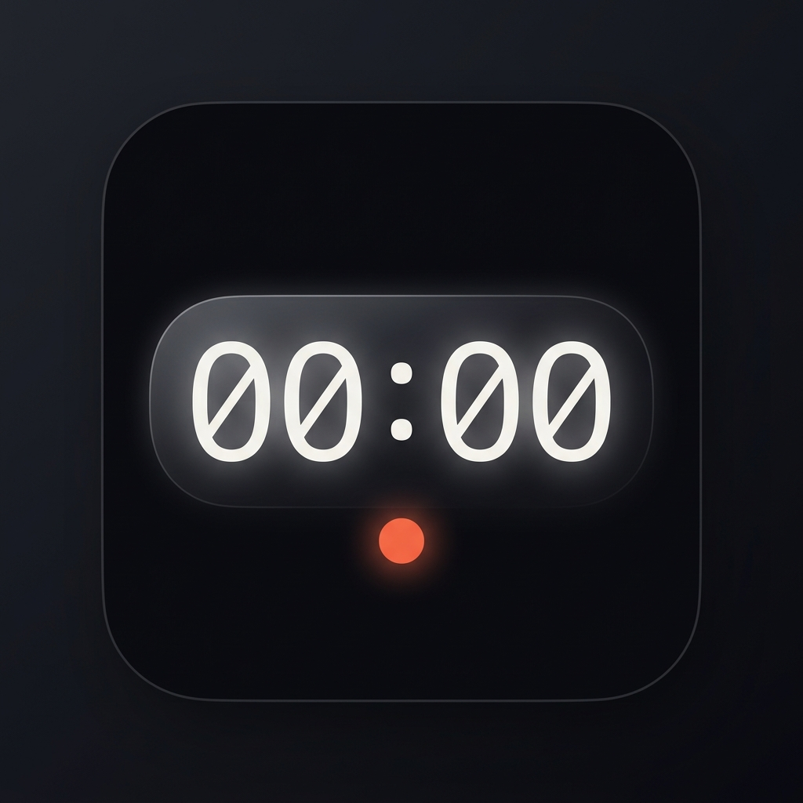

<div align="center">
  
  
  # Momen
  **Professional Timecode Marker Logging for Filmmakers**
</div>

<br />

**Momen** is an offline-first iOS/Android mobile application that allows filmmakers to log timestamped markers during a shoot. With an intuitive and robust glassmorphism UI, markers can be instantly synced and exported natively into formats seamlessly readable by professional Non-Linear Editors (NLEs), completely eradicating manual alignment overhead.

## ✨ Core Features

- ⏱ **High-Precision Logging**: Instant tap-to-mark logic utilizing system-level hardware clocks (`performance.now()`) for microsecond precision.
- 🎬 **Multi-Method Sync**:
  - **Manual Offset**: Direct camera timecode entry for perfect sync.
  - **Clap Sync**: Traditional clapboard method generating a master `SYNC` marker.
- 🗂 **Local Session Management**: Offline-first architecture using local SQLite. No cloud accounts, no network needed on set.
- 🎞 **Broadcast Framerates**: True SMPTE timecode generation supporting `23.976`, `24`, `25`, `29.97 (Drop-Frame)`, and `30` fps.
- 📤 **Instant Editor Export**:
  - **CSV**: Universal tabular data.
  - **FCPXML 1.9**: Direct import to Apple Final Cut Pro (as chapter markers).
  - **EDL (CMX 3600)**: Direct import to Adobe Premiere Pro & DaVinci Resolve.

## 🛠 Tech Stack

Built for maximum cross-platform efficiency and aesthetic quality:
- **Framework:** React Native / Expo (SDK 52)
- **Language:** TypeScript
- **Storage:** Local SQLite (`expo-sqlite`)
- **Styling:** Custom Glassmorphism System
- **Haptics:** `expo-haptics` integration

## 📱 Local Development

```bash
# 1. Clone the repository
git clone https://github.com/btambaya/momen.git
cd momen/momen

# 2. Install dependencies
npm install

# 3. Start the Expo development server
npx expo start
```
Scan the QR code with Expo Go (Android) or the Camera app (iOS) to run on your device.

## 🔨 Building for Android (APK)

```bash
# 1. Generate native Android project
npx expo prebuild --platform android

# 2. Build the APK with Gradle
cd android && ./gradlew assembleRelease
```

The APK will be at:
```
android/app/build/outputs/apk/release/app-release.apk
```

> **Requires:** Java 17 (`java -version` to check). Transfer the APK to your device via AirDrop, email, or USB.

## 🍎 Building for iOS (Xcode / TestFlight)

```bash
# 1. Generate native iOS project
npx expo prebuild --platform ios

# 2. Install CocoaPods dependencies
cd ios && pod install

# 3. Open in Xcode
open *.xcworkspace
```

From Xcode:
- Select your device or simulator as the build target
- **Run** (⌘R) for local testing
- **Product → Archive** for TestFlight / App Store distribution

> **Requires:** macOS, Xcode 15+, and an [Apple Developer account](https://developer.apple.com) ($99/yr) for TestFlight.

## 🧪 Tests

```bash
npm test           # Run all 142 unit tests
npm run test:coverage  # With coverage report
```

## 📐 Project Structure

```text
├── Momen_MVP_Technical_Brief.html  # Comprehensive product specifications
├── implementation_plan.md          # Architecture & step-by-step logic
├── apps/
│   └── Momen_App.apk               # Compiled Android app
└── momen/                          # Main React Native Source
    ├── App.tsx                     # Entry point
    ├── src/
    │   ├── components/             # Reusable UI (GlassCard, Modals)
    │   ├── database/               # SQLite schemas & repositories
    │   ├── engine/                 # SMPTE timecode maths & calculation
    │   ├── export/                 # CMX3600, FCPXML, CSV generators
    │   ├── navigation/             # App routing 
    │   ├── screens/                # Core views (Sessions, Logging, Sync)
    │   └── theme/                  # Global design tokens
    └── assets/                     # Icons and branding
```

## 🔒 Offline Guarantee

Momen is designed to run in environments with zero connectivity. It requires no network requests, tracking, or cloud infrastructure to perform core duties, ensuring rock-solid reliability on remote sets.
