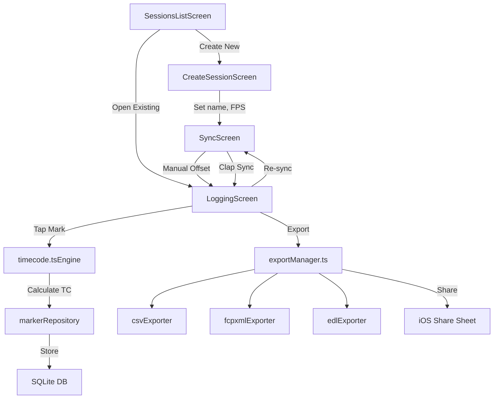

# Momen MVP — Implementation Plan

## Overview

**Momen** is an iOS app for filmmakers to log timestamped markers during a shoot and export them in formats readable by professional editing software (Final Cut Pro, DaVinci Resolve, Premiere Pro).

**Core loop**: Sync to camera timecode → tap to log a marker → export for the editor's NLE.

**Stack**: React Native (Expo) · expo-sqlite · expo-haptics · expo-sharing · expo-file-system

> [!IMPORTANT]
> The two highest-risk components are **timecode sync precision** and **export format correctness** (especially FCPXML 1.9 and EDL drop-frame notation). These are prioritised early in the build.

---

## Proposed Changes

### 1. Project Scaffolding

#### [NEW] Expo project at `/Users/ahmadtambaya/Desktop/video_app/`

- Initialise with `npx create-expo-app@latest ./` (blank template)
- Install dependencies:
  - `expo-sqlite` — local relational storage
  - `expo-haptics` — haptic feedback on marker tap
  - `expo-file-system` — write export files to disk
  - `expo-sharing` — iOS share sheet
  - `@react-navigation/native` + `@react-navigation/native-stack` — screen navigation

---

### 2. Data Layer

#### [NEW] `src/database/db.ts` — Database Setup

SQLite database with two tables:

```sql
sessions (
  id            TEXT PRIMARY KEY,    -- UUID
  name          TEXT NOT NULL,
  date          TEXT,                -- ISO 8601
  sync_method   TEXT NOT NULL,       -- 'manual' | 'clap'
  offset_ms     REAL DEFAULT 0,      -- milliseconds (manual sync only)
  sync_time     TEXT,                -- ISO timestamp of when sync was performed
  frame_rate    REAL NOT NULL,       -- 23.976 | 24 | 25 | 29.97 | 30
  camera_tc     TEXT,                -- camera timecode entered (manual sync)
  created_at    TEXT NOT NULL
)

markers (
  id            TEXT PRIMARY KEY,
  session_id    TEXT NOT NULL,
  marker_number INTEGER NOT NULL,
  timecode_ms   REAL NOT NULL,       -- stored as milliseconds from midnight
  timecode_smpte TEXT NOT NULL,      -- pre-formatted HH:MM:SS:FF
  note          TEXT DEFAULT '',
  is_sync_point INTEGER DEFAULT 0,
  created_at    TEXT NOT NULL,
  FOREIGN KEY (session_id) REFERENCES sessions(id) ON DELETE CASCADE
)
```

#### [NEW] `src/database/sessionRepository.ts`
- `createSession(name, date, frameRate)` → Session
- `getAllSessions()` → Session[]
- `getSession(id)` → Session
- `updateSessionSync(id, method, offsetMs, cameraTc)` → void
- `deleteSession(id)` → void

#### [NEW] `src/database/markerRepository.ts`
- `addMarker(sessionId, timecodeMs, timecodeSmpte, note, isSyncPoint)` → Marker
- `getMarkers(sessionId)` → Marker[]
- `getNextMarkerNumber(sessionId)` → number
- `updateMarkerNote(markerId, note)` → void
- `deleteMarker(markerId)` → void

---

### 3. Timecode Engine

#### [NEW] `src/engine/timecode.ts` — Core Timecode Utilities

This is the most critical module. All timecode math lives here.

**Key functions:**

| Function | Purpose |
|----------|---------|
| `msToSmpte(ms, fps)` | Convert milliseconds → `HH:MM:SS:FF` string |
| `smpteToMs(smpte, fps)` | Convert `HH:MM:SS:FF` string → milliseconds |
| `calculateOffset(cameraTcMs, deviceTimeMs)` | Returns offset in ms |
| `applyOffset(deviceTimeMs, offsetMs)` | Returns adjusted ms |
| `isDropFrame(fps)` | Returns true for 29.97 |
| `msToFrames(ms, fps)` | Convert ms to frame count |
| `framesToSmpte(frames, fps)` | Convert frame count to SMPTE string (handles drop-frame) |

**Drop-frame logic (29.97fps)**:
- Skip frames 0 and 1 at the start of every minute, **except** every 10th minute
- Display uses semicolons: `HH:MM:SS;FF` (per SMPTE convention)

**Precision approach**:
- Use `performance.now()` for relative timing (monotonic, immune to clock adjustments)
- Record `performance.now()` at sync moment and at every marker tap
- Offset = `cameraTcMs - performanceNowAtSync`
- Marker TC = `performanceNowAtTap + offset` → convert to SMPTE

---

### 4. Export Engine

#### [NEW] `src/export/csvExporter.ts`

Generates a standard CSV file:
```
Marker Number,Timecode,Duration,Note,Sync Point
1,01:00:05:12,00:00:01:00,"Camera A wide",FALSE
```
- Duration defaults to `00:00:01:00` (1 second at the session's frame rate)
- SYNC marker gets note: `"Align this marker to the frame of the clap in your footage to synchronise all subsequent markers."`

#### [NEW] `src/export/fcpxmlExporter.ts`

Generates FCPXML 1.9 compliant XML:
- Root `<fcpxml version="1.9">`
- `<library>` → `<event>` → `<project>` → `<sequence>` → `<spine>` structure
- Each marker as a `<chapter-marker>` with rational time values
- Rational time format: convert ms to `numerator/denominator` based on frame rate
  - e.g. at 24fps: frame 0 = `0/24s`, frame 1 = `100/2400s`, etc.
  - At 29.97fps (actually 30000/1001): use `1001*frame/30000s`
- SYNC marker as first entry with editor instruction in `value` attribute

> [!WARNING]
> FCPXML rational time representation is the trickiest part. Using integer frame counts with the correct timebase avoids floating-point drift. We'll represent times as `frame_count * 100 / (fps * 100)` to keep everything integer-based.

#### [NEW] `src/export/edlExporter.ts`

Generates CMX 3600 EDL:
```
TITLE: Session Name
FCM: DROP FRAME / NON-DROP FRAME

001  AX       V     C        01:00:05:12 01:00:06:12 01:00:05:12 01:00:06:12
* FROM CLIP NAME: Marker 1
* COMMENT: Camera A wide
```
- Single-frame edit event per marker (1-second duration)
- Drop-frame notation (`;`) for 29.97fps, non-drop (`:`) for all others
- SYNC marker as event 001 with instruction in comment

#### [NEW] `src/export/exportManager.ts`

- Generates all three files simultaneously
- File naming: `{SessionName}_{YYYYMMDD}_markers.csv / .fcpxml / .edl`
- Writes to `FileSystem.cacheDirectory`
- Presents iOS share sheet via `expo-sharing` (or `Sharing.shareAsync` with multiple files)
- For clap sync sessions: shows confirmation dialog before share sheet

---

### 5. Screens & Navigation

#### [NEW] `src/navigation/AppNavigator.tsx`

Stack navigator with 4 screens:

```
SessionsListScreen → CreateSessionScreen → SyncScreen → LoggingScreen
                   → LoggingScreen (reopening existing session)
```

#### [NEW] `src/screens/SessionsListScreen.tsx` — Home

- Lists all sessions (name, date, marker count, sync method badge)
- "New Session" button
- Swipe-to-delete on each session
- Tap a session → open LoggingScreen (review mode)

#### [NEW] `src/screens/CreateSessionScreen.tsx`

- Session name input (required)
- Date picker (defaults to today)
- Frame rate selector (pill buttons: 23.976 / 24 / 25 / 29.97 / 30)
- "Continue" → navigates to SyncScreen

#### [NEW] `src/screens/SyncScreen.tsx`

Two-option selection screen:

**Manual Offset card:**
1. Four input fields for HH:MM:SS:FF (auto-advance between fields)
2. "Sync Now" button → captures `performance.now()` at tap instant, calculates offset
3. Shows confirmation with offset value

**Clap Sync card:**
1. Instruction text explaining the clap workflow
2. "Start Session" → navigates to LoggingScreen with first marker pre-flagged as sync point

#### [NEW] `src/screens/LoggingScreen.tsx` — Primary Screen

Layout (top to bottom):
1. **Header bar** — Session name, sync status indicator, re-sync button, settings gear
2. **Running timecode display** — Large monospaced `HH:MM:SS:FF` updating at frame rate, offset-adjusted for manual sync
3. **Marker list** — Scrollable chronological list (marker #, timecode, note snippet). Swipe to delete.
4. **Mark button** — Large, centred, prominent. One-thumb tappable.
5. **Export button** — Bottom bar

**On tap of Mark button:**
1. Capture `performance.now()` immediately (before any other work)
2. Calculate adjusted timecode
3. Haptic feedback (`Haptics.impactAsync(ImpactFeedbackStyle.Medium)`)
4. Insert marker into DB
5. Optional: prompt for note (small modal or inline text field that doesn't block marking flow)

**Note entry UX:** After tapping mark, a small text input slides up below the latest marker in the list. User can type a note and tap Done, or ignore it and tap Mark again (the input dismisses and the note is saved as empty).

---

### 6. Shared Components

#### [NEW] `src/components/TimecodeDisplay.tsx`
- Large monospaced running counter
- Updates via `requestAnimationFrame` or `setInterval` at frame-rate frequency
- Shows offset-adjusted time for manual sync, raw device time for clap sync

#### [NEW] `src/components/TimecodeInput.tsx`
- Four-segment SMPTE input (HH / MM / SS / FF)
- Numeric keyboard, auto-advance, validation per segment

#### [NEW] `src/components/MarkerListItem.tsx`
- Displays: marker number, SMPTE timecode, note (truncated), sync badge if sync point
- Swipe to delete

#### [NEW] `src/components/FrameRatePicker.tsx`
- Horizontal pill buttons for 23.976 / 24 / 25 / 29.97 / 30

---

## Architecture Diagram



---

## Build Order (Phased)

| Phase | What | Why |
|-------|------|-----|
| **1** | Project setup + DB schema + data repositories | Foundation everything else depends on |
| **2** | Timecode engine (`timecode.ts`) with unit tests | Highest risk — must be correct before UI work |
| **3** | Export engines (CSV → EDL → FCPXML) with unit tests | Second highest risk — format correctness is critical |
| **4** | Navigation + SessionsList + CreateSession screens | Basic flow scaffolding |
| **5** | SyncScreen (both methods) | Unlocks the core loop |
| **6** | LoggingScreen (mark button, timecode display, marker list) | The primary user experience |
| **7** | Export integration (generate + share sheet) | Completes the core loop |
| **8** | Polish — haptics, note entry UX, delete flows, edge cases | Definition of Done items |

---

## Open Questions

> [!IMPORTANT]
> **Multiple file sharing**: iOS share sheet via `expo-sharing` only supports one file at a time. Options:
> 1. Share a **zip** of all three files (simplest)
> 2. Use `react-native-share` which supports multiple file URIs
> 3. Share files one at a time with a picker ("Which format?")
>
> **Recommendation**: Option 2 (share all three simultaneously) matches the brief best. If that causes issues, fall back to Option 1 (zip).

> [!NOTE]
> **FCPXML validation**: The brief requires FCPXML to validate against Apple's DTD. I'll test the output structure against the published FCPXML 1.9 spec, but full DTD validation requires an XML validator. I'll ensure structural correctness and test import manually.

---

## Verification Plan

### Automated Tests
- Unit tests for `timecode.ts`: ms↔SMPTE conversion at all 5 frame rates, drop-frame edge cases
- Unit tests for each exporter: generate output and verify structure/content
- Test offset calculation: verify `marker_tc = camera_tc + elapsed_since_sync`

### Manual Verification (your side)
- Run the 19-step Definition of Done checklist from the brief
- Import FCPXML into Final Cut Pro and verify marker positions
- Import EDL into DaVinci Resolve and Premiere Pro
- Open CSV in Excel
- Test on a fresh device with no internet connection (steps 18-19)
